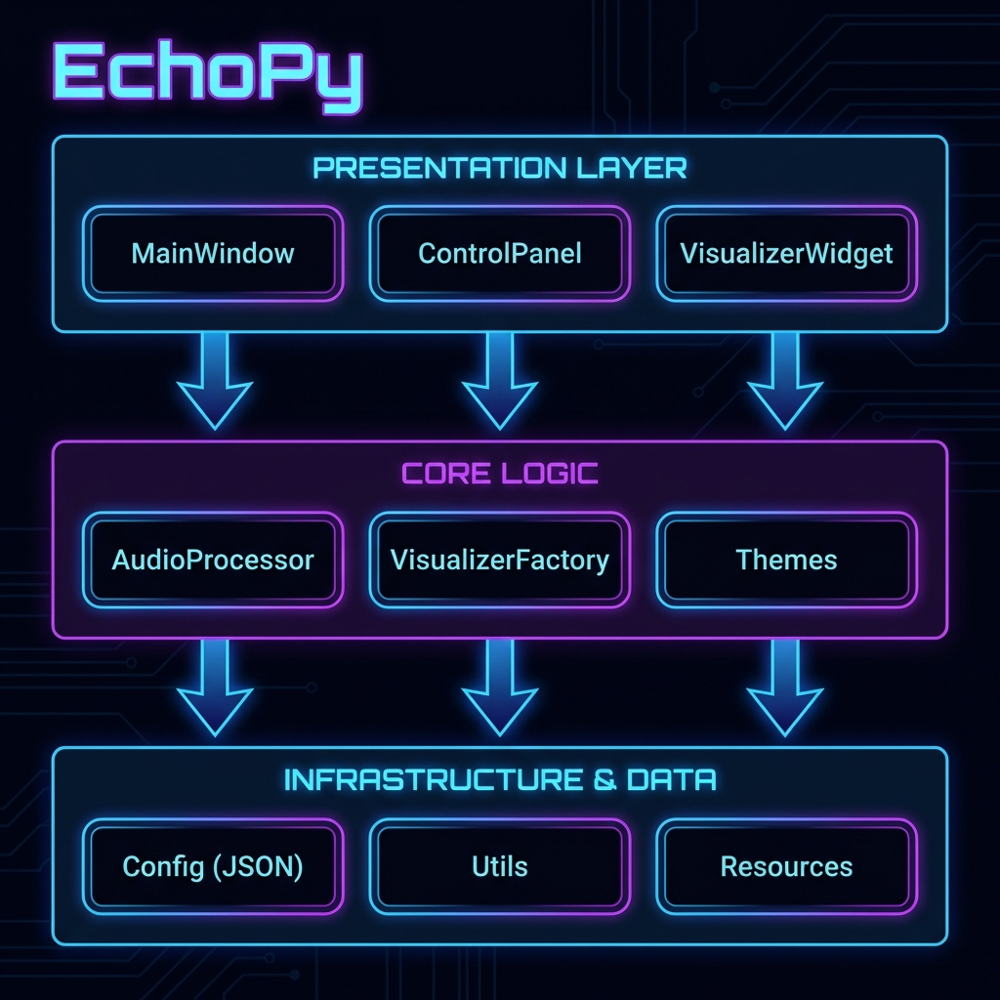
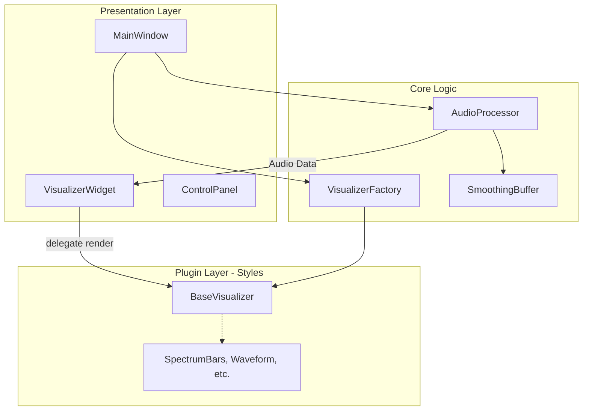
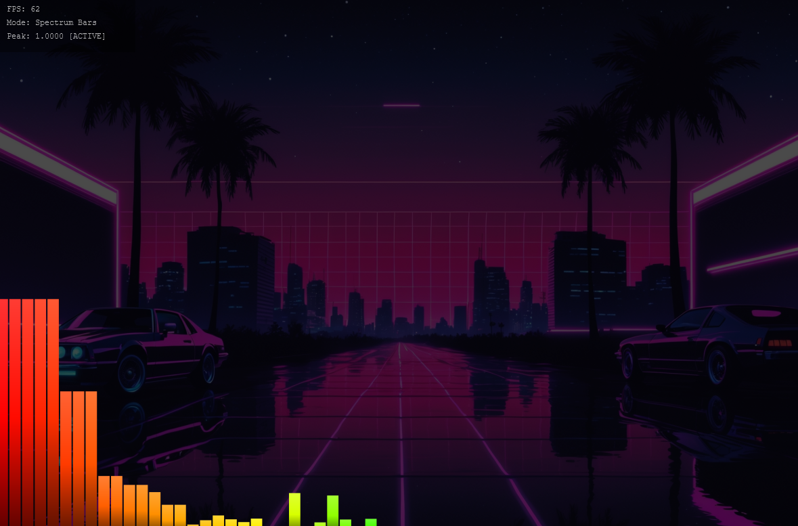
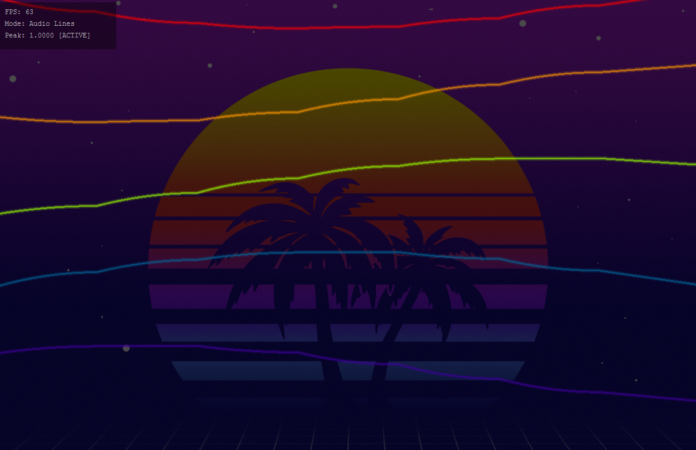
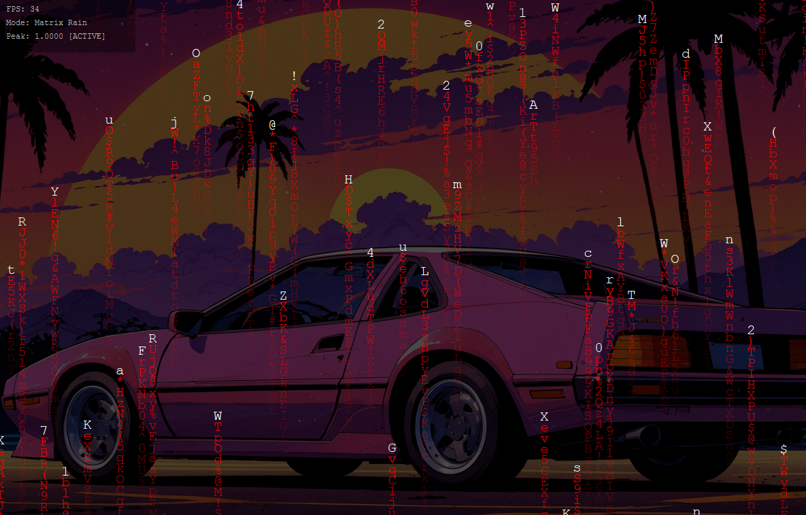

# 🎵 EchoPy - Modern Music Visualizer


**EchoPy** is a stunning real-time audio visualizer built with Python, featuring 10+ unique visualization styles, 10 beautiful color themes, and support for custom backgrounds.

## ✨ Features

### 🎨 10+ Visualization Styles

- **Spectrum Bars** - Classic frequency analyzer with gradient bars
- **Waveform** - Time-domain wave with glow effects
- **Circular Spectrum** - Radial frequency display
- **Particles** - Physics-based particle system
- **Radial Bars** - Rotating sunray effect
- **Fire Effect** - Heat map simulation
- **Matrix Rain** - Cyberpunk falling characters
- **Oscilloscope** - Lissajous curves with CRT effects
- **Frequency Rings** - Expanding ripple patterns
- **Audio Lines** - Flowing Bezier curves

### 🌈 Premium Color Themes

1. **Modern** - Indigo to Cyan gradients (Premium default)
2. **Cyberpunk** - High-contrast Neon Pink & Blue
3. **Aurora** - Northern Lights inspired (Green/Blue) [NEW]
4. **Spectre** - Ultra-violet to Cyan neon [NEW]
5. **Aesthetic** - Soft pastel colors
6. **Classic** - Retro green monochrome
7. **Fire** - intense Red to yellow flame colors
8. **Ocean** - Deep blue to cyan waves
9. **Sunset** - Warm Orange and Purple hues
10. **Neon** - Bright multi-color spectrum
11. **Rainbow** - Full ROYGBIV spectrum

### 🎛️ Advanced Features

- 🪟 **Frameless & Translucent** - True "Glass" transparent backgrounds overlapping your desktop
- 🖼️ **Custom backgrounds** - Persistent background loading
- 🎚️ **Audio device selection** - Choose input source
- ⚙️ **Configurable settings** - Adjust smoothing, sample rate, FFT size, and Gain in real-time
- 🖥️ **Fullscreen mode** - Immersive experience (F11)
- 💾 **Settings persistence** - Robust saving to AppData
- 📊 **Real-time performance** - 60 FPS smooth rendering
- 💎 **Premium UI** - Glassmorphism, SVG icons, and modern controls

## Architecture

EchoPy follows a decoupled architecture inspired by Clean Architecture and SOLID principles.





## 📸 Gallery

<p float="left">
  
   
  
</p>

## 🚀 Installation

### Prerequisites

- Python 3.8 or higher
- Audio input device (microphone or line-in)

### Install Dependencies

```bash
pip install -r requirements.txt
```

## 💻 Usage

### Running from Source

```bash
python src/main.py
```

### Keyboard Shortcuts

- `F11` - Toggle fullscreen
- `Ctrl+H` - Show/hide control panel
- `Ctrl+,` - Open settings
- `Ctrl+Q` - Quit application
- `ESC` - Exit fullscreen

### �️ Mouse Controls

- **Right-Click** anywhere to open the **Main Menu** (Settings, Toggle Controls, Fullscreen, Exit).

## 📦 Building Executables

### Windows

```bash
# Install PyInstaller
pip install pyinstaller

# Build executable
pyinstaller build.spec

# Find executable in dist/EchoPy.exe
```

### Linux

```bash
# Install PyInstaller
pip install pyinstaller

# Build executable
pyinstaller build.spec

# Find executable in dist/EchoPy
```

The generated executable will be approximately 100-150MB due to bundled dependencies.

## 🎮 Controls

### Control Panel

Access via `Ctrl+H` or `Right-Click > Toggle Controls`.

- **Visualization Style** - Dropdown to select visualization mode
- **Color Theme** - Grid of theme buttons for quick switching
- **Background** - Load custom images or clear background

### Settings Dialog

Access via `Ctrl+,` or `Right-Click > Preferences`.

- **Input Device** - Select audio source
- **Sample Rate** - 22050, 44100, or 48000 Hz
- **FFT Size** - Trade-off between frequency/time resolution
- **Smoothing** - Adjust visual stability (0.0 to 1.0)
- **BG Opacity** - Background image transparency
- **FPS Limit** - Set maximum frame rate

## 🔧 Configuration

Settings are automatically saved to `config.json` in the user's data directory (ensuring persistence even after updates):

- **Windows**: `%LOCALAPPDATA%\EchoPy\config.json`
- **Linux/Mac**: `~/.local/share/EchoPy/config.json`

```json
{
  "theme": "modern",
  "style": "spectrum_bars",
  "sample_rate": 44100,
  "fft_size": 2048,
  "smoothing": 0.8,
  "background_image": null,
  "fps_limit": 60
}
```

## 📝 Project Structure

```
EchoPy/
├── src/
│   ├── main.py              # Application entry point
│   ├── audio_processor.py   # Audio capture and FFT
│   ├── visualizer.py        # Base visualizer classes
│   ├── themes.py            # Color theme definitions
│   ├── utils.py             # Utility functions
│   ├── styles/              # Visualization implementations
│   └── ui/                  # User interface components
├── resources/               # Icons and assets
├── requirements.txt
├── build.spec              # PyInstaller configuration
└── README.md
```

## 🎯 Performance Tips

1. **Lower FFT Size** - Faster processing, less frequency detail
2. **Reduce Smoothing** - More responsive but jittery
3. **Limit FPS** - Lower values reduce CPU usage
4. **Simpler Styles** - Spectrum Bars and Waveform are fastest

## 🐛 Troubleshooting

### No Audio Input

- Check that your microphone is connected and enabled
- Select the correct input device in Settings
- Grant microphone permissions if prompted

### Low Frame Rate

- Close other applications to free up CPU
- Reduce FPS limit in settings
- Try simpler visualization styles
- Lower FFT size

### Capturing System Audio

By default, EchoPy captures from microphone. To visualize music playing on your computer:

**Windows:**

- Install [VB-Audio Virtual Cable](https://vb-audio.com/Cable/)
- Set it as default playback device
- Select "CABLE Output" in EchoPy settings

**Linux:**

- Use PulseAudio Monitor: `pavucontrol`
- Or JACK audio routing

## 📄 License

MIT License - See LICENSE file for details

## 🤝 Contributing

Contributions are welcome! Feel free to:

- Report bugs
- Suggest new visualization styles
- Add new color themes
- Improve performance
- Enhance documentation

## 🙏 Credits

Built with:

- [PySide6](https://www.qt.io/qt-for-python) - Qt for Python GUI framework
- [NumPy](https://numpy.org/) - Numerical computing
- [sounddevice](https://python-sounddevice.readthedocs.io/) - Audio I/O

---

**Enjoy visualizing your music! 🎶✨**
